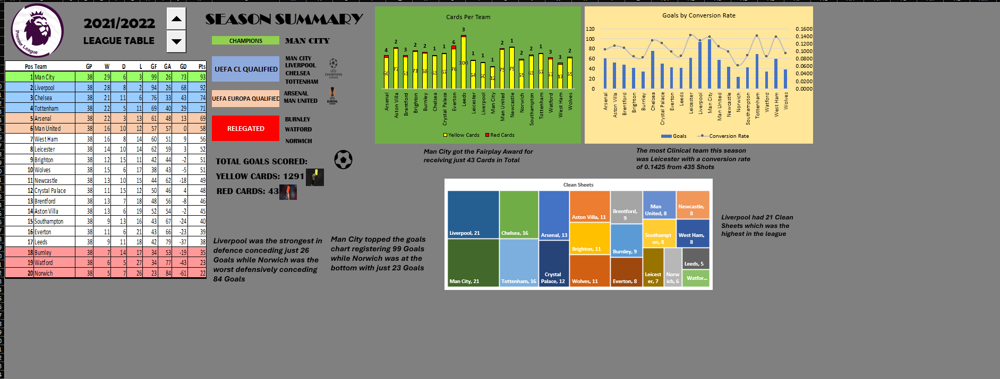

# Premier League Season Dashboard (2000/01 – 2021/22)

An interactive Excel dashboard that rebuilds the Premier League table for any season from 22 years of match results and writes its own season summary.



Choose a season with the spin button and the workbook pulls that season's 380 matches, recalculates the league table from scratch (wins, draws, losses, goals, points, cards, clean sheets, shots and conversion rate), marks the champions, European places and relegated clubs, and generates plain-English highlights such as the best defence, the most clinical attack and the fewest cards.

## Highlights

- **Home advantage vanished without fans.** In 2020/21, played almost entirely behind closed doors, away teams won more matches than home teams (40.3% vs 37.9%), the only time this happened in 22 seasons.
- **Champions are strong at both ends.** Every champion ranked in the top three for goals scored, and 21 of 22 ranked in the top three for fewest goals conceded.
- **40 points is almost always enough.** It would have kept a club up in 21 of 22 seasons; the team finishing 17th averaged 38 points.
- **More goals, fewer red cards.** Goals per match rose from 2.57 (2000/01–2008/09) to 2.75 (2009/10–2021/22), while red cards fell by about a third.
- **A league of six.** Man United, Chelsea, Arsenal, Liverpool, Man City and Tottenham took 83 of 88 top-four places and 21 of 22 titles.

## Project at a glance

| Area | Details |
|---|---|
| Tool | Microsoft Excel (Microsoft 365) |
| Data | 8,360 matches · 22 seasons · 44 clubs |
| Techniques | Power Query (combine files from a folder), Excel Tables, Data Model, dynamic arrays (`FILTER`, `SORT`, `UNIQUE`), `XLOOKUP`, `COUNTIFS`/`SUMIF` aggregation, ranking with tie-breaks, form controls, Camera tool, combo, stacked and treemap charts, formula-driven text |
| Output | A one-page interactive dashboard with auto-generated insights |

## Workbook structure

| Sheet | What it does |
|---|---|
| Dashboard | Season selector, live league table, KPI cards, three charts and an auto-written season summary |
| Raw Data | The `EPL_Data` table: all 8,360 matches, loaded and shaped with Power Query |
| Processed Data | The calculation engine: the selected season's matches, the league table, season leaders and summary sentences |

## The data

Match results for 2000/01 to 2021/22, one CSV file per season, in the football-data.co.uk format (`Div` code `E0` is the Premier League).

| Column | Meaning |
|---|---|
| `Source.Name` | Season, e.g. 2012/2013 |
| `Div` | Division code (`E0` = Premier League) |
| `Date` | Match date |
| `HomeTeam`, `AwayTeam` | The two clubs |
| `FTHG`, `FTAG` | Full-time goals (home, away) |
| `FTR` | Full-time result: `H`, `D` or `A` |
| `Result` | Calculated column: the winning club, or "Draw" |
| `Referee` | Match referee |
| `HS`, `AS` | Shots (home, away) |
| `HST`, `AST` | Shots on target (home, away) |
| `HY`, `AY` | Yellow cards (home, away) |
| `HR`, `AR` | Red cards (home, away) |

**Quality checks:** every season has 380 matches, 20 clubs and 38 games per club; there are no missing values or duplicate fixtures; and every `FTR` value agrees with the scoreline.

## How it was built

### 1. Data preparation in Power Query

The 22 season files are combined with **Get Data → From Folder → Combine Files**. Each raw file has 45 columns, so the query keeps only the 16 needed, plus the source file name to identify the season, and drops half-time scores, attendance, corners, fouls, offsides, woodwork hits, booking points and bookmaker odds. Data types are set in the query, and the result loads to an Excel Table (`EPL_Data`) and the Data Model. A calculated column then records the winner of each match:

```text
=IF([@FTR]="H",[@HomeTeam],IF([@FTR]="A",[@AwayTeam],IF([@FTR]="D","Draw","N/A")))
```

### 2. The season engine (Processed Data sheet)

Everything on the dashboard flows from one cell. A spin button writes a number from 0 to 21 to `Dashboard!A1`, which is converted into a season name. `FILTER` then spills that season's 380 matches, and the league table is calculated from them:

```text
Season picker    =INDEX('Processed Data'!S2:S23, 22-Dashboard!A1)
Season matches   =FILTER(EPL_Data[], EPL_Data[Source.Name]=Dashboard!B1)
Club list        =SORT(UNIQUE(D3:D382))
Wins             =COUNTIF($I$3:$I$382, V3)
Draws            =SUM(COUNTIFS($I$3:$I$382,"Draw",$E$3:$E$382,V3), COUNTIFS($I$3:$I$382,"Draw",$D$3:$D$382,V3))
Goals for        =SUM(SUMIF($D$3:$D$382,V3,$F$3:$F$382), SUMIF($E$3:$E$382,V3,$G$3:$G$382))
Clean sheets     =SUM(COUNTIFS($D$3:$D$382,V3,$G$3:$G$382,0), COUNTIFS($E$3:$E$382,V3,$F$3:$F$382,0))
Points           =SUM(X3*3, Y3*1, Z3*0)
Conversion rate  =AA3/AI3
Position         =RANK.EQ($AD3,$AD$3:$AD$22) + COUNTIFS($AD$3:$AD$22,$AD3,$AC$3:$AC$22,">"&$AC3)
League table     =SORT(U3:AD22, 1, 1)
Season leader    =XLOOKUP(MAX($AA$3:$AA$22), $AA$3:$AA$22, $V$3#)
```

Positions are ranked on points, with goal difference as the tie-breaker. Summary sentences are assembled with text formulas and linked to text boxes on the dashboard, for example:

```text
=W33&" topped the goals chart registering "&X33&" Goals while "&W34&" was at the bottom with just "&X34&" Goals"
```

### 3. The dashboard

- **Season selector:** a spin button, with a linked text box showing the chosen season.
- **League table:** a live Camera-tool picture of the sorted table, with zones for the champions, Champions League places (1st–4th), Europa League places (5th–6th) and relegation (18th–20th). Club names in each zone are looked up by position.
- **KPI cards:** total goals, yellow cards and red cards for the season.
- **Charts:** *Goals by Conversion Rate* (columns for goals scored, a line for goals per shot), *Cards Per Team* (stacked yellow and red cards) and *Clean Sheets* (treemap).
- **Season summary:** auto-generated sentences covering attack, defence, clean sheets, finishing and discipline.

## Season snapshot: 2012/13

The workbook is saved on 2012/13, and this is what the dashboard reports:

| Category | 2012/13 |
|---|---|
| Champions | Man United, 89 points (11 clear of Man City) |
| Top four | Man United, Man City, Chelsea, Arsenal |
| Relegated | Wigan, Reading, QPR |
| Most goals | Man United, 86 |
| Fewest goals | QPR, 30 |
| Best defence | Man City, 34 conceded and a league-high 18 clean sheets |
| Worst defence | Reading and Wigan, 73 conceded each |
| Most clinical | Man United, 16.8% of shots scored (86 from 512) |
| Fewest cards | Southampton, 45 |
| Most cards | Stoke, 84 |
| Season totals | 1,063 goals · 1,186 yellow cards · 52 red cards |

Man United won that title with only the fifth-best defence (43 conceded), which makes them the only champion in these 22 seasons outside the top three for goals conceded. They made up for it with the league's best attack and its highest conversion rate.

## Season-by-season summary

Here is the same summary for every season in the data. Where clubs tied, both are shown.

| Season | Champions (pts) | Margin | Most goals scored | Fewest goals conceded | Relegated |
|---|---|---|---|---|---|
| 2000/01 | Man United (80) | 10 | Man United (79) | Man United (31) | Man City, Coventry, Bradford |
| 2001/02 | Arsenal (87) | 7 | Man United (87) | Liverpool (30) | Ipswich, Derby, Leicester |
| 2002/03 | Man United (83) | 5 | Arsenal (85) | Man United (34) | West Ham, West Brom, Sunderland |
| 2003/04 | Arsenal (90) | 11 | Arsenal (73) | Arsenal (26) | Leicester, Leeds, Wolves |
| 2004/05 | Chelsea (95) | 12 | Arsenal (87) | Chelsea (15) | Crystal Palace, Norwich, Southampton |
| 2005/06 | Chelsea (91) | 8 | Chelsea, Man United (72) | Chelsea (22) | Birmingham, West Brom, Sunderland |
| 2006/07 | Man United (89) | 6 | Man United (83) | Chelsea (24) | Sheffield United, Charlton, Watford |
| 2007/08 | Man United (87) | 2 | Man United (80) | Man United (22) | Reading, Birmingham, Derby |
| 2008/09 | Man United (90) | 4 | Liverpool (77) | Chelsea, Man United (24) | Newcastle, Middlesbrough, West Brom |
| 2009/10 | Chelsea (86) | 1 | Chelsea (103) | Man United (28) | Burnley, Hull, Portsmouth |
| 2010/11 | Man United (80) | 9 | Man United (78) | Chelsea, Man City (33) | Birmingham, Blackpool, West Ham |
| 2011/12 | Man City (89) | GD | Man City (93) | Man City (29) | Bolton, Blackburn, Wolves |
| 2012/13 | Man United (89) | 11 | Man United (86) | Man City (34) | Wigan, Reading, QPR |
| 2013/14 | Man City (86) | 2 | Man City (102) | Chelsea (27) | Norwich, Fulham, Cardiff |
| 2014/15 | Chelsea (87) | 8 | Man City (83) | Chelsea (32) | Hull, Burnley, QPR |
| 2015/16 | Leicester (81) | 10 | Man City (71) | Man United, Tottenham (35) | Newcastle, Norwich, Aston Villa |
| 2016/17 | Chelsea (93) | 7 | Tottenham (86) | Tottenham (26) | Hull, Middlesbrough, Sunderland |
| 2017/18 | Man City (100) | 19 | Man City (106) | Man City (27) | Swansea, Stoke, West Brom |
| 2018/19 | Man City (98) | 1 | Man City (95) | Liverpool (22) | Cardiff, Fulham, Huddersfield |
| 2019/20 | Liverpool (99) | 18 | Man City (102) | Liverpool (33) | Bournemouth, Watford, Norwich |
| 2020/21 | Man City (86) | 12 | Man City (83) | Man City (32) | Fulham, West Brom, Sheffield United |
| 2021/22 | Man City (93) | 1 | Man City (99) | Liverpool, Man City (26) | Burnley, Watford, Norwich |

*Margin* is the gap in points to second place. In 2011/12 Man City and Man United finished level on points, and City won the title on goal difference.

## Key insights across 22 seasons

The dashboard answers "what happened in this season?". Looking across the full `EPL_Data` table reveals the longer-term patterns below. These figures come from the same match data but aren't on the dashboard yet (see [Future improvements](#future-improvements)).

### 1. Home advantage is real, until the fans disappear

Across all 8,360 matches, home teams won 45.9% of the time, earned 1.63 points per game to visitors' 1.12, and scored 1.52 goals per match to 1.16. The 2020/21 season, played almost entirely behind closed doors, is the only one where that flipped: away teams won more often, earned more points per game (1.43 vs 1.36) and scored almost exactly as many goals (1.34 vs 1.35 per match).

| Seasons | Home wins | Draws | Away wins | Yellow cards per match (home / away) |
|---|---|---|---|---|
| Other 21 seasons | 46.3% | 25.1% | 28.6% | 1.42 / 1.76 |
| 2020/21 | 37.9% | 21.8% | 40.3% | 1.42 / 1.45 |

The yellow-card gap closed too. Away sides normally receive about 24% more yellow cards than home sides, but without crowds the difference all but disappeared, which fits the idea that crowds influence refereeing decisions.

### 2. Titles are won at both ends of the pitch

Every champion ranked in the top three for goals scored, 21 of 22 ranked in the top three for fewest conceded, and 19 of 22 had the league's best or joint-best attack or defence. Across all 440 club-seasons, goal difference tracks final points almost perfectly, while discipline barely registers:

| Metric | Correlation with points |
|---|---|
| Goal difference | 0.97 |
| Goals scored | 0.90 |
| Goals conceded | −0.85 |
| Clean sheets | 0.79 |
| Shots | 0.74 |
| Conversion rate (goals per shot) | 0.68 |
| Total cards | −0.25 |

Champions averaged 89 points, ranging from 80 (Man United in 2000/01 and 2010/11) to 100 (Man City in 2017/18). The tightest title race was 2011/12, decided on goal difference, and three more titles were won by a single point (2009/10, 2018/19 and 2021/22). The biggest winning margins were 19 points in 2017/18 and 18 in 2019/20.

### 3. The "40 points for safety" rule holds, just

The team finishing 17th averaged 37.9 points, and in 17 of 22 seasons a club stayed up with fewer than 40. Forty points would have been enough to survive in 21 of 22 seasons; the exception is 2002/03, when West Ham were relegated with 42. At the other end of the table, 4th place took 69.6 points on average (range 60–79).

### 4. More goals, fewer red cards

Goals per match rose from 2.57 in 2000/01–2008/09 to 2.75 in 2009/10–2021/22, and the share of matches with three or more goals climbed from 47.3% to 52.6%. The lowest-scoring season was 2006/07 (2.45 per match) and the highest were 2018/19 and 2021/22 (2.82). Red cards fell by about a third, from an average of 67 a season in the first six seasons to 43.5 in the last six, while yellow cards stayed between 2.7 and 3.6 per match with no clear trend.

### 5. Clinical finishing pays

The club with the best conversion rate each season finished 3.2nd on average, made the top four in 15 of 22 seasons and won the title eight times, including four seasons in a row from 2014/15 to 2017/18 (Chelsea, Leicester, Chelsea, Man City). Relegated clubs didn't just take fewer shots; they converted fewer of them too. Cards, by contrast, made almost no difference:

| Average per season | Relegated clubs | All other clubs |
|---|---|---|
| Goals scored | 35.0 | 53.7 |
| Goals conceded | 67.4 | 47.9 |
| Clean sheets | 6.8 | 11.7 |
| Shots | 390 | 471 |
| Conversion rate | 9.0% | 11.4% |
| Cards | 64.8 | 62.6 |

### 6. A league of six

Man United, Chelsea, Arsenal, Liverpool, Man City and Tottenham took 83 of the 88 top-four places and 21 of the 22 titles. The exceptions were Leeds (4th in 2000/01), Newcastle (4th in 2001/02 and 3rd in 2002/03), Everton (4th in 2004/05) and Leicester's title in 2015/16.

| Club | Seasons | Titles | Top-four finishes | Total points |
|---|---|---|---|---|
| Man United | 22 | 7 | 17 | 1,698 |
| Chelsea | 22 | 5 | 17 | 1,665 |
| Arsenal | 22 | 2 | 16 | 1,603 |
| Liverpool | 22 | 1 | 14 | 1,591 |
| Man City | 21 | 6 | 12 | 1,440 |
| Tottenham | 22 | 0 | 7 | 1,370 |

Only six clubs played in all 22 seasons: Man United, Chelsea, Arsenal, Liverpool, Tottenham and Everton. Man City's rise is the standout story: relegated in 2000/01 and joint-lowest scorers in 2006/07 with 29 goals, they finished no lower than 5th from 2009/10 onwards and won six of the last 11 titles. For promoted clubs, survival is close to a coin flip: 27 of 63 (43%) went straight back down, and the average promoted side finished 15th. The best first season back was Wolves' 7th place in 2018/19.

### 7. Records in the data

| Record | Holder | Season |
|---|---|---|
| Most points | Man City, 100 | 2017/18 |
| Most goals scored | Man City, 106 | 2017/18 |
| Fewest goals conceded | Chelsea, 15 (plus 25 clean sheets) | 2004/05 |
| Unbeaten season | Arsenal, W26 D12 L0 | 2003/04 |
| Fewest points | Derby, 11 (20 scored, 89 conceded) | 2007/08 |
| Most cards | Leeds, 103 | 2021/22 |
| Biggest wins | Southampton 0–9 Leicester · Man United 9–0 Southampton | 2019/20 · 2020/21 |
| Highest-scoring match | Portsmouth 7–4 Reading | 2007/08 |

## Data notes and limitations

- **Points deductions aren't applied**, because the table is calculated from results. The only one in this period is Portsmouth's 9-point deduction in 2009/10; they finish bottom either way.
- **European places are assigned by league position** (1st–4th Champions League, 5th–6th Europa League). In reality, qualification also depended on domestic cup winners, and the Europa League was the UEFA Cup before 2009/10. In 2012/13, for example, Everton finished 6th but didn't qualify, because cup winners Swansea and Wigan took those places.
- **Tied season leaders:** when clubs are level on a summary metric, the dashboard names the first alphabetically. In 2012/13, Reading and Wigan both conceded 73, but only Reading is named.
- **Shots on target aren't comparable before and after 2013/14.** They drop from about 14 per match in 2012/13 to about 9 in 2013/14 while total shots barely move, which points to a change in how the source recorded them. Goals per shot is comparable across all seasons; goals per shot on target is only comparable within each era.
- **Referee names are inconsistent:** there are 157 different spellings for roughly 72 referees (for example "Mike Dean", "M Dean" and "Dean, M. L"), so referee analysis would need a cleaning step first.
- **"Fewest cards"** is a simple count of yellow and red cards, not the Premier League's official Fair Play table.

## Future improvements

- Add goals scored as a third tie-breaker for league position. Four seasons have clubs level on points and goal difference (for example Leeds and Wolves in 2003/04), which currently leaves them sharing a position.
- Name every tied club in the summary sentences using `TEXTJOIN(" & ", TRUE, FILTER(...))`.
- Replace the typed season list with `UNIQUE(EPL_Data[Source.Name])` and a drop-down (or update the spin button's maximum), so new seasons such as 2022/23 appear automatically after a refresh.
- Add a trends page, using PivotTables and PivotCharts on the Data Model, to bring the cross-season insights above into the workbook.
- Standardise referee names in Power Query to open up referee analysis.
- Complete the Shots Faced column to add defensive shot metrics.

## How to use

1. Open `EPL_Sheet_2.xlsx` in Excel for Microsoft 365 or Excel 2021 and later (needed for the dynamic array functions and `XLOOKUP`).
2. On the **Dashboard** sheet, click the spin button's arrows to move between seasons. The table, charts, KPI cards and summary all update automatically.
3. To refresh from new CSV files, point the Power Query source at your own folder via **Data → Get Data → Data Source Settings**, then choose **Refresh All**.

## Repository contents

```text
├── EPL_Sheet_2.xlsx      # Workbook: Dashboard, Raw Data, Processed Data
├── README.md
└── images/
    └── dashboard.png     # Dashboard screenshot
```

## Author

**Ibomeno Basiekanem** · [GitHub](https://github.com/TheLordBass) · [Portfolio](https://thelordbass.github.io)
